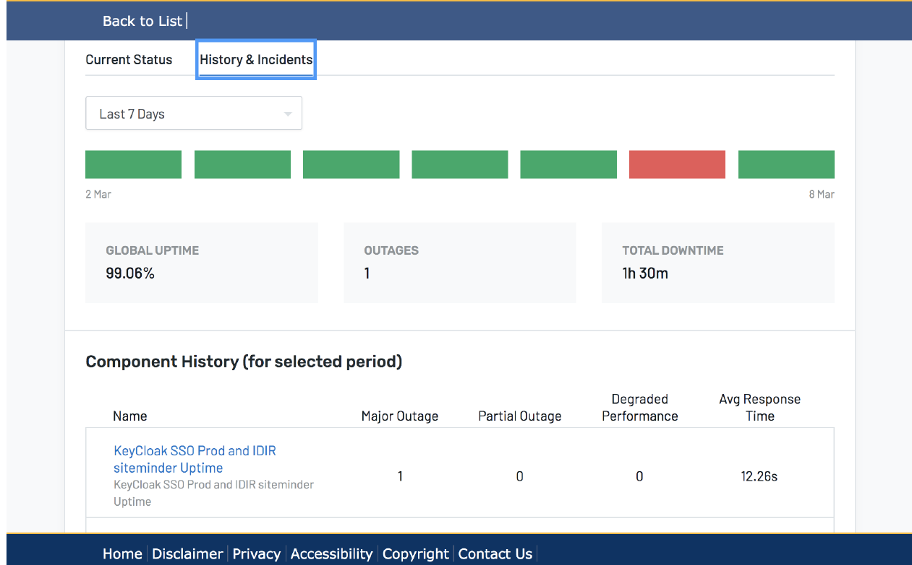
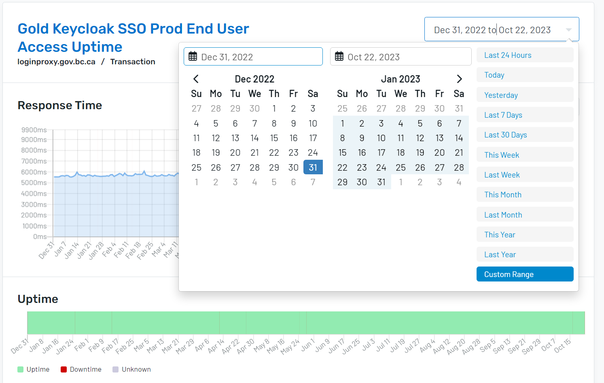
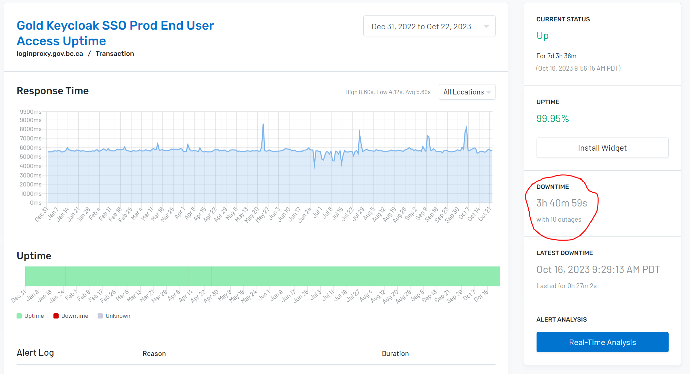

# Alerts and Us
Here's an overview of our Service Levels and Metrics on our acknowledge and response times:

## Service Levels
We often get questions about our Service Level Agreement and over the years we've come to realize the answer is not that simple. This an attempt to plain language our Service Levels, other systems that impact our SLA as we are a subset of a larger system, our approach to keeping systems stable and reliable, and our future thinking.

## What is our Service
Our service, the Pathfinder SSO ensures that our Keycloak server acts as an [Open ID Connect OIDC](https://openid.net/connect/) based Identity Provider, mediating with an enterprise user directory or 3rd-party SSO providers for identity information and applications via standards-based tokens and identity assertions.

Specifically, we make use of the Red Hat SSO v 7.6.1.GA

**Other systems we rely on**

The Pathfinder SSO service is hosted on the Private Cloud Openshift platform in the government data centers in Kamloops and Calgary (DR). There are planned and unplanned outages that impact the infrastructure that our service is hosted in and thus impact the availability of the service.

**Private Cloud Platform as a Service (Platform Services)**

We are a subset of a larger ecosystem of services within BC Government. Our Keycloak server sits on the [BCGov Private Cloud Platform as a Service aka Openshift](https://cloud.gov.bc.ca/private-cloud).
Planned outages on the Openshift platform have minimal impact on our end user uptime due to the Switchover/GoldDR process (15-30 minutes at most).

The current availability commitments for the Gold/Gold DR Openshift service is 99.95%.

Reference: [Private Cloud Memorandum of Understanding](https://cloud.gov.bc.ca/private-cloud/our-services-in-private-cloud-paas/memorandum-of-understanding-for-private-cloud-paas/) and [Private Cloud Hosting Tiers](https://cloud.gov.bc.ca/private-cloud/our-products-in-the-private-cloud-paas/silver-and-gold-tier-platforms/)

**BC Government Kamloops and Calgary Data Centers**

It should be noted together with the Private Cloud/Platform Services Team we are reliant on the service levels agreed upon by the
Province an the Kamloops/Calgary Data Centers. The unplanned outage to the Data Centers are out of our control and impact our Service Level Target.

The current availability commitments for the Data Centers are 99.5%.

**Identity Partners**

We have a healthy relationship with our Access Directory Management Services (ADMS/WAM) team and the Provincial Identity Information Management (IDIM) team who are the identity providers for IDIR and BCeID. Any unplanned outages or impact to these identity services are out of our control and impact our Service Level Target.

## Do you think our service (keycloak) is down?

Here are the things to check:

1. Check our uptime status at https://status.loginproxy.gov.bc.ca
2.  if you see the IDIR/siteminder uptime alert in red, there may be a larger goverment wide issue. We will provide live updates as we learn more in our [rocketchat channel](https://chat.developer.gov.bc.ca/channel/sso)
3.  if you see the other alerts please know we are working to resolve this. We will post in [rocketchat channel](https://chat.developer.gov.bc.ca/channel/sso) and update the history and incident section
4. you can always reach a human via our [rocketchat channel](https://chat.developer.gov.bc.ca/channel/sso) or by emailing us at bcgov.sso@gov.bc.ca

 {: style="width:600px;height:372px;"}

### Our Service Level Target 2024

Working as DevOps Agile team maintaining high system availability and reliability is paramount to our Service Levels.

We aim to keep our Service available 99.95% noting that some months we may be 99.9% due to linked systems and their outages beyond our control.

This is SLA is is based on the highest SLA for the services we rely on.

**What does 99.99, 99.95 vs 99.9 mean?**

99.99 translates to 4  min of downtime/outage mode a month

99.95 translates to  21 min of downtime/outage mode a month

99.9 translates to 40 min of downtime/outage mode a month

#### Service Level Defined
As of writing (April 2023) we define our service levels as:

•	Our service is available 24/7, except during planned outages within the Kamloops and Calgary data centres. Planned outages are communicated through [RocketChat](https://chat.developer.gov.bc.ca/channel/sso)

•	Our regular business hours are weekdays from 9:00 am to 5:00 pm Pacific Time, excluding statutory holidays. Client provisioning questions and requests will be reviewed and handled during normal business hours.  After hours support is provided by the Pathfinder SSO team, and is only available for service outages and other incidents that impact the service

•	To learn more about our service uptime monitoring, please [visit our uptime page](Pathfinder-Uptime-Monitoring) and join our [newsletter](https://subscribe.developer.gov.bc.ca/) to receive important updates on the service and any outages.

**Our approach to stability and reliability (Support Incident Response Times)**

The Pathfinder SSO Team responds to 4 levels of incidents. The team responds to all service incidents through our 24/7 process where our team is alerted of the incident. Our internal target response times are:

> Critical - P1 - Outage detected by uptime.  Response time: <15 minutes during business hours, <30 minutes after hours.
>
> High - P2 - Sysdig warnings about stability that may cause an outage if left unaddressed. Response time: <30 minutes during business hours, <60 minutes after hours.
>
> Moderate - P3 - Moderate severity warning from Sysdig that does not require immediate human intervention. Response time: <30 minutes during business hours, best effort after hours.
>
> Low - P4 - Any warning from Sysdig alerts that reflects less than perfect system health, but doesn't indicate any kind of outage in the near future. Response time: <45 minutes during business hours, best effort after hours.
>

As a very responsive team, you will see our metrics over the years and that we respond  very quickly [2022 and 2023 Recap of Alerts/Incidents](Alerts-and-Us.md#metrics)

It should be noted that our current version of Redhat SSO does not enable us to offer zero downtime aka [blue green deployments](https://docs.aws.amazon.com/whitepapers/latest/introduction-devops-aws/blue-green-deployments.html). As a result, when we need to upgrade our Redhat SSO version or need to apply a patch, we advise our clients in advance via [RocketChat](https://chat.developer.gov.bc.ca/channel/sso) with a note that active sessions may be lost ie: end users may have to login again.

**Change Communications**

When a change occurs on our service, we will provide notification in advance in these ways:

**Minor changes** are announced 24 hours in advance in the [Rocket.Chat #sso channel.](https://chat.developer.gov.bc.ca/channel/sso) An example of a minor change is tied to small bug fixes or other low-impact changes.

**Emergency change**s are announced as soon as possible in advance in the [Rocket.Chat #sso channel.](https://chat.developer.gov.bc.ca/channel/sso)  channel. An emergency change is performed to recover a failed service, prevent a failure or address a security vulnerability.

**Medium/Major changes** are announced five (5) business days in advance in the [Rocket.Chat #sso channel.](https://chat.developer.gov.bc.ca/channel/sso)  channel. An example of a medium change is an upgrade to the keycloak version number, with limited impacts.

##### Our Service Uptime

We do make use of uptime monitoring to help report out on our service levels. We monitor 3 things with uptime:
1.	Is our service up?
2.	Can any user get in?
3.	Can a user affiliated with an identity provider ie IDIR user get in?

[See more details](https://uptime.com/statuspage/bcgov-sso-gold)

**Cost**

There is no cost for the BC Gov's Pathfinder SSO service for B.C. government ministries, central agencies, and Crown corporations in the 2023/2024 fiscal year.  There may be a cost model introduced in the following fiscal years. To receive updates, sign up for the [sso newsletter](https://subscribe.developer.gov.bc.ca/).

**Future Thinking**
As a [DevOps Agile team](https://aws.amazon.com/devops/what-is-devops/) , we want to minimize the downtime our clients have. Our current focus is to complete our Openshift Silver Keycloak migration to Openshift Gold Keycloak and then we hope to have cycles to innovate and pursue zero down time (eventually move to [ROSA](https://aws.amazon.com/rosa/) or maybe when Redhat SSO is linked with [Keycloak Quarkus](https://www.keycloak.org/downloads).
Join our monthly open demos as we share where we are going.

# Metrics

## Historic Uptime

The uptime for a given alert over a range by using a custom range on the alert screen:

 {: style="width:600px;height:380px;"}

Uptime will calculate the total downtime for the alert

 {: style="width:600px;height:325px;"}

### Gold Keycloak SSO Prod End User Access Uptime
| Month          | Downtime |
| -------------- | -------  |
| January   2024 | 0s       |
| February  2024 | 0s       |
| March     2024 | 0s       |
| April   2024 | 1h 47m 32s |
| May       2024 | 0s |
| June      2024 | 0s |
| **July      2024** | **0s** |
| August    2024 |  |
| September 2024 |  |
| October   2024 |  |
| November  2024 |  |
| December  2024 |  |

**Note**: April 2024 alerts look like they were due to an uptime false alarm.

| Month          | Downtime |
| -------------- | ------- |
| January   2023 | 41m 6s |
| February  2023 | 36m 21s |
| March     2023 | 0 |
| April     2023 | 1h5m30s |
| May       2023 | 51m00s |
| June      2023 | 0 |
| July      2023 | 0 |
| August    2023 | 0 |
| September 2023 | 0 |
| October   2023 | 0h27m2s |
| November  2023 | 0s |
| December  2023 | 0s |

### Gold KeyCloak SSO Prod and IDIR siteminder Uptime

| Month          | Downtime  |
| -------------- | --------- |
| January   2024 | 1h 3m 19s |
| February  2024 | 0s        |
| March     2024 | 14m 5s    |
| April     2024 | 2h 27m 56s |
| May       2024 | 1h 57m 22s |
| June      2024 | 0s |
| **July      2024** | **0s** |
| August    2024 |  |
| September 2024 |  |
| October   2024 |  |
| November  2024 |  |
| December  2024 |  |

**Note**: April 2024 alerts look like they were due to an uptime false alarm.

| Month          | Downtime |
| -------------- | -------- |
| January   2023 | 1h0m18s  |
| February  2023 | 38m12 |
| March     2023 | 56m40s |
| April     2023 | 1h51m46s |
| May       2023 | 1h38m45s |
| June      2023 | 0 |
| July      2023 | 6m 43s |
| August    2023 | 0 |
| September 2023 | 0 |
| October   2023 | 0h35m25s |
| November  2023 | 0h25m28s |
| December  2023 | 0h06m18s |

## 2024

##### P1 Stats
| Month      | Number of Alerts | Acknowledge Time | Resolve Time    | Notes |
| :---        |     :----:   |   :----:   |          ---: |---: |
| January   | 0 | NA | NA | NA  |
| February  | 0 | NA | NA | NA  |
| March     | 2 |  24s | 7m 2s |  Idir monitoring check failed March 21 and 22.  Communicated it to IDP partner. |
| April     | 3 | 2m 25s | 1h 25m 10s | Uptime was having time out issues on the 20th, could not reproduce even in uptime, suspect false alarm  |
| May       | 16 | 5m 26s | 7m 19s | All related to the IDIR check failing, outage communitated to the IDP partner.  |
| June      | 0 | NA | NA | NA  |
| July      | 0 | NA | NA | NA  |
| August    |  |  |  |   |
| September |  |  |  |   |
| October   |  |  |  |   |
| November  |  |  |  |   |
| December  |  |  |  |   |

##### P2 Stats

| Month      | Number of Alerts | Acknowledge Time | Resolve Time    | Notes |
| :--- | :----: | :----: | ---: | ---: |
| January   | 0 | NA | NA | NA |
| February  |  3 | 1m 24s | 1m 58s | 2 Feb 12 1 Feb 21 All 3 for elevated CPU 2 from the gold upgrade, 1 From our production upgrade |
| March     | 0 | NA | NA | NA |
| April     | 2 | 3m 53s | 6m 29s | The filesystem alerts on production showed that the pods were filling up. No outage was caused, likely and internal keycloak clean up process. |
| May       | 1 | 18s | 1m 0s | Elevated CPU May 29 during prod roll out, expected, No outage  |
| June      | 0 | NA | NA | NA  |
| July      | 0 | NA | NA | NA  |
| August    |  |  |  |   |
| September |  |  |  |   |
| October   |  |  |  |   |
| November  |  |  |  |   |
| December  |  |  |  |   |

#### Priority 3 aka Moderate Impact to Service --
Pathfinder Team commits to acknowledging issue within 15 -30 mins and resolving as quickly as possible
##### P3 Stats
| Month      | Number of Alerts | Acknowledge Time | Resolve Time    | Notes |
| :--- | :----: | :----: | ---: |---: |
| January   | 5 | 11m 23s | 11m 23s | All dev and test uptime idir issues from a January 21 network outage  |
| February  | 0 | NA | NA | NA |
| March     | 0 | NA | NA | NA |
| April     | 9 | 1m 24s | 57m 57s |Uptime was having time out issues on the 20th and 25th, could not reproduce even in uptime, suspect false alarm |
| May       | 19 | 4m 39s | 9m 25s | All related to the dev and test IDIR check failing, outage communitated to the IDP partner.  |
| June      | 0 | NA | NA | NA  |
| July      | 0 | NA | NA | NA  |
| August    |  |  |  |   |
| September |  |  |  |   |
| October   |  |  |  |   |
| November  |  |  |  |   |
| December  |  |  |  |   |

#### Priority 4 aka Low Impact to Service --
Pathfinder Team commits to acknowledging issue within 15 -30 mins and resolving as quickly as possible
##### P4
| Month      | Number of Alerts | Acknowledge Time | Resolve Time    | Notes |
| :---        |     :----:   |   :----:   |          ---: |---: |
| January   | 2 | 1m 58s | 1m 58s | dev db filled to 90% during Jan 21 network issues |
| February  | 2 | 1m 3s | 1m 43s | 1 on 12 Feb Med CPU spike due to upgrade, 1 on 21st Feb due to production upgrade |
| March     | 0 | NA | NA | NA |
| April     | 3 | 7m 3s | 12m 19s | The filesystem alerts on production showed that the pods were filling up. No outage was caused, likely and internal keycloak clean up process.  |
| May       | 11 | 3m 7s | 6m 18 | Minor PVC alerts about storage capacity and some CPU alerts triggered during roll outs of prod  |
| June      | 5 | 1m 36s | 1m 49s | All on june 11 and 12 All due to low level PVC storage warnings 60% full. No impact on system stability |
| July      | 0 | NA | NA | NA  |
| August    |  |  |  |   |
| September |  |  |  |   |
| October   |  |  |  |   |
| November  |  |  |  |   |
| December  |  |  |  |   |

## 2023
### Incidents

Note the piorities of opsgenie alerts were modified in December 2023 to make the alerts more informative. Dev and test uptime alerts were promoted to P3s and many Sysdig alerts were downgrader to P2s.

#### Priority 1 aka Critical Impact to Service -- no end users can log into their apps connected to keycloak
Pathfinder Team commits to acknowledging issue within 15 -20 mins and resolving as quickly as possible
##### P1 Stats
| Month      | Number of Alerts | Acknowledge Time | Resolve Time    | Notes |
| :---        |     :----:   |   :----:   |          ---: |---: |
| January      |  6 | 2min 11s       | 45m 26s  |  Jan 25 & Jan 24 - OCP Upgrade |
| February      |  0 | 0       | 0| 0  |
| March      |  16 | 1m 10s      | 5m24| March 2& 3  intermittent idir issues March 6 tied to sm vendor guidance. March 18 tied to platform services work|
| April      |  7 | 2m22s       | 6m48s| April 4 uptime time out issue. April 5 Prod fixes by us. April 11 uptime Global script execution timeout |
| May      |  21 | 6m08s       | 20m57s| May 24 CPU surge that may have been caused by logging, May 28 STMS work triggered timeouts |
| June     |  1 | 0m01s       | 0m01s| June 12: CPU spike over 5, not outage, Gold Upgrade Day |
| July     |  2 | 0m31s       | 4m09s| July 28: CPU spike over 5, and Idir login failure. Caused by CPU surge in the Keycloak Pods, discussion with RedHat to resolve root cause |
| August |  1 | 0m39s       | 3m28s| Aug 1: Uptime failed check, carryover from July outage|
| September|  0 | 0       | 0| NA|
| October|  3 | 2m12s       | 19m55s| Oct 16 CPU spike causing lag on login (end-users still able to log in, system slow) Oct 18 short uptime misfire in alerting |
| November|  4 | 5m18s       | 10m0s| Nov 7 had three Sysdig Alerts about CPU spikes/patroni pods low, no outage.  Nov 22 had an IDIR uptime outage (service stayed up) |
| December | 1 | 0m53s | 6m19s | Production Idir loggin failed, keycloaks itself stayed up |

##### P2 Stats

| December | 0 | 0m0s | 0m00s | NA |

#### Priority 3 aka Moderate Impact to Service --
Pathfinder Team commits to acknowledging issue within 15 -30 mins and resolving as quickly as possible
##### P3 Stats
| Month      | Number of Alerts | Acknowledge Time | Resolve Time    | Notes |
| :---        |     :----:   |   :----:   |          ---: |---: |
| January      |  3 | 12 min52s      | 14m 19s  |  Jan 25 & Jan 24 - OCP Upgrade |
| February      |  8  | 6m 51s      | 7m 41s | Feb 2 & Feb 13 kc upgrade; Feb 4 pvc/db size in dev; Feb 6 pods cycling? |
| March      |  0  | 0      | 0 | 0  |
| April      |  0  | 0      | 0 | 0  |
| May      |  3  | 3m14      | 3m14 | related to silver openshift upgrade  |
| June     |  3  | 2m26      | 2m55 | 1 silver alert, gold upgrade on June 12 |
| July     |  0  | 0m00s      | 0m00s | Ops genie did trigger some call out alerts but they were unrelated to stability. |
| August |  0 | 0       | 0| NA|
| September |  1 | 21s       | 21s| Not a real alert, call came in|
| October|  2 | 45m32s       | 46m03s| Not real alerts, came in from the call system |
|  November | 5 | 2m36s | 4m7s | All alerts related to the Nov 7 upgrade, no outage on that day |
|  December | 5 | 4m53s | 19m35s | All 5 were dev and test idir login failures on the 13th and 14th of December |

#### Priority 4 aka Low Impact to Service --
Pathfinder Team commits to acknowledging issue within 15 -30 mins and resolving as quickly as possible
##### P4
| Month      | Number of Alerts | Acknowledge Time | Resolve Time    | Notes |
| :---        |     :----:   |   :----:   |          ---: |---: |
| January      |  17 | 9min 56s    | 46m 15s  |  Jan 25 & Jan 24 - OCP Upgrade |
| February      |  15  | 13m 12s       | 15m 41s 0  |
| March      |  5  | 12m 53s       | 16m 48s  | siteminder in dev and test; db pvc over 90%; Gold cpu usage med
| April      |  13 | 2m53s      | 7m49s | April 5 Prod fixes by us. April 11 uptime Global script execution timeout  |
| May       |  23 | 7m41s      | 29m11s | May 24 CPU surge, May 28 STMS work, May 30 PVC warning  |
| June      |  5 | 2m09s      | 2m36s | June 12 gold upgrade  |
| July      |  12 | 2m41s      | 5m41s | July 5, July 11, July 25 - backup PV size warning, July 27 and 28 Had 'low pod' and 'cpu spike' warnings.  Resolved by cycling the pods.  Discussions with Redhat resolved the root issue.  |
| August |  0 | 0       | 0| NA|
| September |  7 | 1m24s       | 1m25s| Backup DB at 60% the other 6 were ready pods low, triggered during a keycloak pod roll over manually triggered|
| October|  14 | 17m03s       | 17m17s| 8 dev or test uptime alerts, 6 ready pod low alerts for prod (natural part of cycling pods) |
| November |  15 | 4m52s       | 5m50s| 2 Uptime idir outages on Nov 22 (service stayed up), 13 from Nov 7 upgrade, no outage  |
|  December | 1 | 0m59s | 0m59s | December 7 2023, database backup storage hit 60% threshold |

### Total mins of outages
TBD

### 2022
#### P1
| Month      | Number of Alerts | Acknowledge Time | Resolve Time    | Notes |
| :---        |     :----:   |   :----:   |          ---: |---: |
| June      |  25 | 3m 43s       | 4m 10s  |   |
| July   | 2| 8m 17s      | 9m 44ss      |  |
| August   | 6 | 11m 37s        | 8h 45 m  |  _siteminder/network issue [Aug 5](https://chat.developer.gov.bc.ca/channel/sso?msg=FpfxtgJN9BEfMaenC)_  Aug 17 tbd |
| September   | 19 | 9m 22s        | 30m 5s      | Sept 7, [sept 12](https://chat.developer.gov.bc.ca/channel/sso?msg=YpwwatnNGnTRc7q3J), [Sept 25](https://chat.developer.gov.bc.ca/channel/sso?msg=hWAzCD7GMM7Wyy2q7) |
| October | 4 | 12m 31s        | 16m 37s      | oct 5, Oct 12 Oct 23 Oct 27|
| November | 0 | 0       | 0   | 0|
| December| 0 | 0       | 0   | 0|

#### P3
| Month      | Number of Alerts | Acknowledge Time | Response Time    |
| :---        |     :----:   |   :----:   |          ---: |
| June      |  30 | 7m 32s       | 27m 23ss  |
| July   | 2 |10m 55s   | 10m 58s      |
| August   | 3 | 6m 5s       | 6m 34s      |
| sept | 4 |3m 15s | 1 h 18m 46s | |
| Oct   |  | |    |
| Nov   |  | |    |
| Dec   | 2 | 9m 8s|  20m 59s  |

#### P4
| Month      | Number of Alerts | Acknowledge Time | Response Time    |
| :---        |     :----:   |   :----:   |          ---: |
| June      |  27 | 14m 9s       | 15m 50s  |
| July   | 2 |10m 55s   | 10m 58s      |
| August   | 3 | 6m 5s       | 6m 34s      |
| sept | 7|2m 2s | 2m 13s | |
| Oct   | 4 | 1m 18s | 1m 18s   |
| Nov   | 5  | 22m 35s | 36m 9s   |
| Dec   | 14 | 2m 29s |  2m 49s  |
