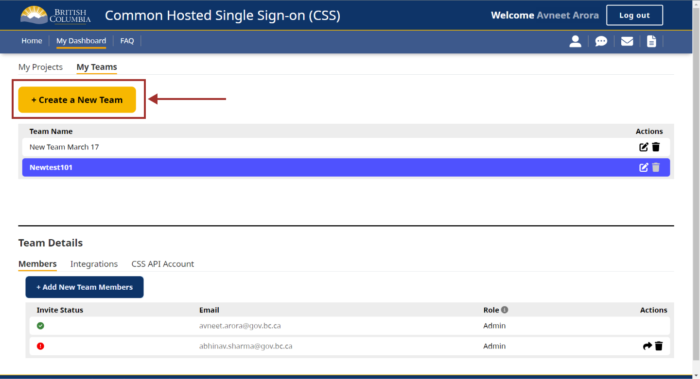
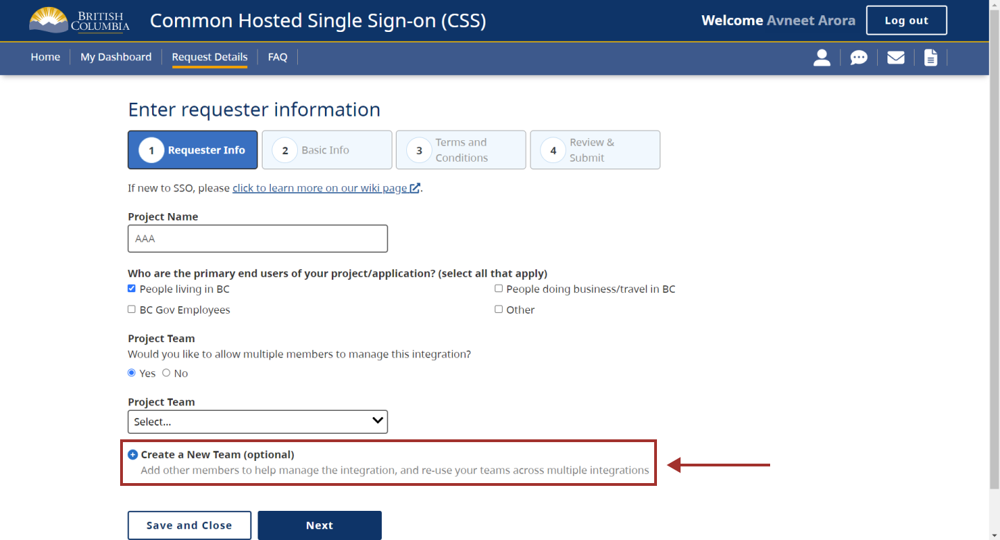
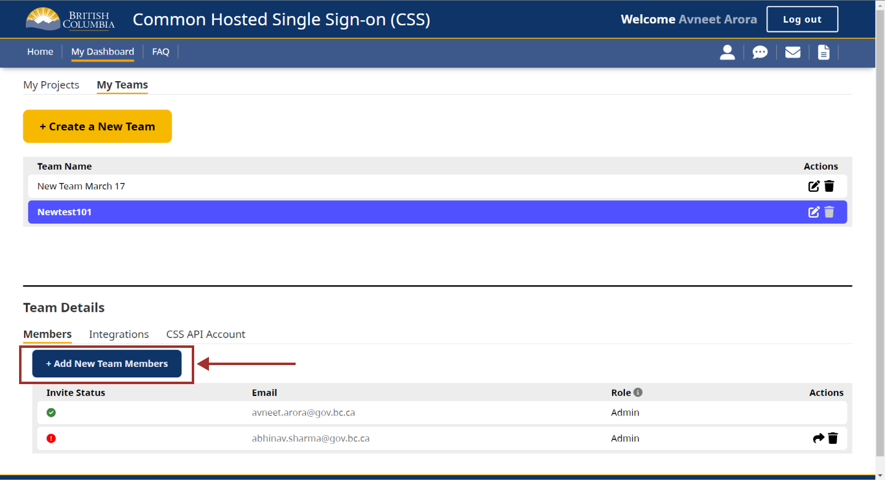
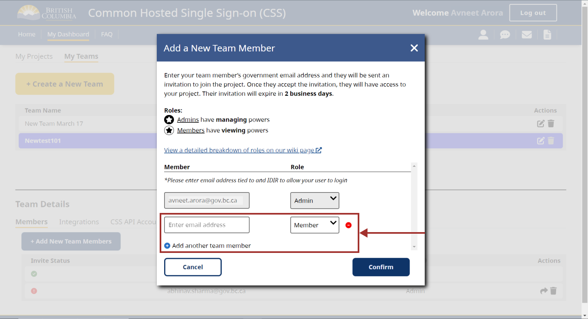
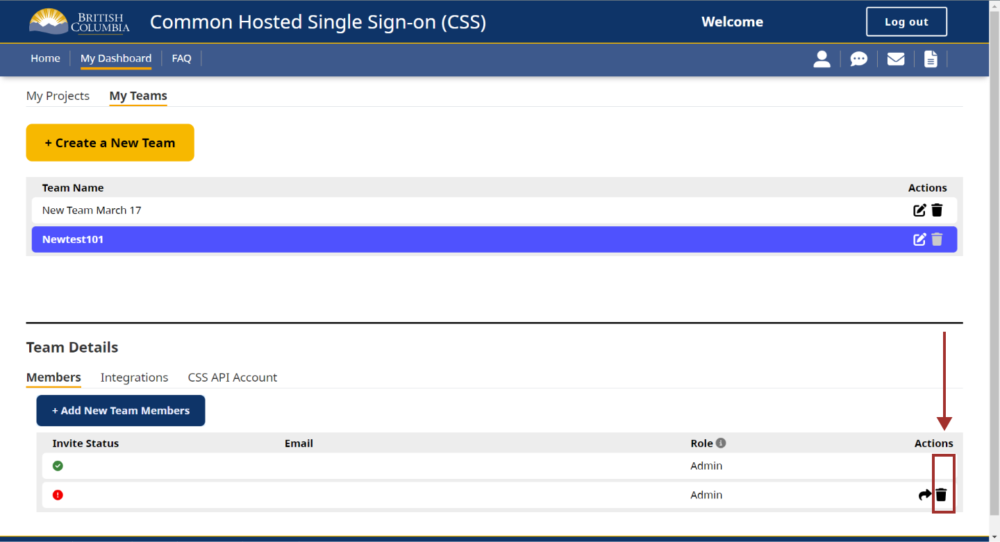
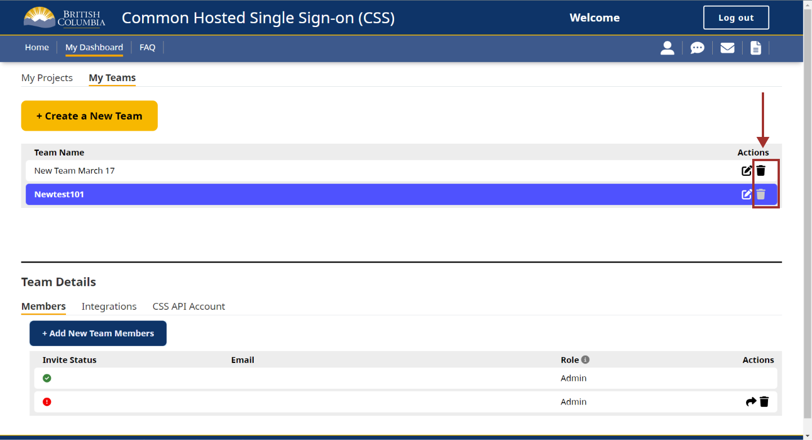

# Overview of My Teams
We've heard from our clients on the value of our product, the Common Hosted Single Sign On  (CSS) App and a request for a feature to allow others to have access to the integrations you create with our CSS App, so let's talk about the concept of Teams!

Within the CSS App, you can create a team which allows you to add others to your team, manage the integration and manage the CSS API account you've requested.

## How do I create a team?

There are two ways to create teams within the CSS app.

Method 1: Go to my “My Teams” tab, and select the “+Create a New Team” button.

  {: style="width:380px;height:300px;"}

Method 2: Go to the “My Projects” tab, select “+Request SSO Integration”, and select “Yes” for creating a project team.

  {: style="width:380px;height:300px;"}

#### Relationship between Teams and Projects

A team can be associated to one or more projects/integrations.

### I've created a team, now what?

You're an **admin**: When you create a Team, you are automatically assigned an Admin role. As an Admin, your permissions let you manage both Integrations and Teams.

You can add other _**team members**_: You can add others to your team with either the Admin role or Member role. The key difference is that Admins can manage teams and Members cannot.

#### Managing an integration
When creating a team, you can assign this team to one integration, or several integrations. This will allow all users on the team to view and manage the integration. Here's a table to show the difference between what a **Team Admin** and a _**Team Member**_ can do with an integration:

| Managing Integration(s) Function | Admin Role | Team Member Role |
| ----------- | ----------- | ----------- |
| Create | **Admin** | _**Team Member**_ |
| View | **Admin** | _**Team Member**_ |
| Edit   | **Admin** | _**Team Member**_ |
| Delete| **Admin** | N/A     |

#### Managing a team as an Admin
Users with the **Admin** role can manage teams.

##### Adding New Team Members:

**Admins** can add new users to a Team, and assign users as either Admins or Members.

To add a new Team member, **Admins** must use a government email address, to ensure the user can login to the app. Once an invitation is sent, the new team member have 2 business days to login to the CSS App to be added to the team. If the team member is unable to login within this time period, their invitation link will expire. In this case, Admins can resend the invitation link from the Dashboard, under the “My Teams” tab.

  {: style="width:380px;height:300px;"}

or

  {: style="width:380px;height:300px;"}

##### Changing Team Members Roles & Deleting Team Members:

Under the “My Teams” tab, **Admins** can also change a user’s role, or delete the user

##### Here's a table to show what an Admin and a Team member can do with a team

Here's a table to show the difference between what a Team Admin and a Team Member can do with an integration:
*Note: Anyone with an IDIR account can create a team and become the Admin

| Managing Team(s) Function | Admin Role | Team Member Role |
| ----------- | ----------- | ----------- |
| Create Team Name and Membership| **Admin** | N/A |
| View Team Name and Members | **Admin** | _**Team Member**_ |
| Edit Team Name | **Admin** | N/A |
| Delete Team | **Admin** | N/A  |
| Assign Team Members | **Admin** | N/A  |
| Unassign Team Members | **Admin** | N/A  |

#### Managing a Role associated to Integration

When creating an integration, some teams may want to create roles associated to the integration. More on roles here https://github.com/bcgov/sso-keycloak/wiki/Creating-a-Role

Only an **Admin** can create roles and once the roles are created, Admins and Members can assign users to the role.

| Managing Roles Associated to Integration  Function | Admin Role | Team Member Role |
| ----------- | ----------- | ----------- |
| Create Role Name| **Admin** | N/A |
| View Role Name | **Admin** | _**Team Member**_ |
| Edit Role Name | **Admin** | N/A |
| Delete Role Name | **Admin** | N/A  |

| Assigning Users to Roles Associated to Integration Function | Admin Role | Team Member Role |
| ----------- | ----------- | ----------- |
| Assign User to Role | **Admin** | _**Team Member**_ |
| View Users of a specific Role | **Admin** | _**Team Member**_ |
| Unassign User to Role | **Admin** | _**Team Member**_ |

#### Managing Access to CSS API Account

**Admins** can also create a CSS API Account for a team, which will allow you to interact with CSS Application in a RESTful way for both user and role management. [Learn more about the CSS API Account in our wiki page.](https://bcgov.github.io/sso-docs/integrating-your-application/css-app-api)

| Managing Access to CSS API Function | Admin Role | Team Member Role |
| ----------- | ----------- | ----------- |
| Create API Account| **Admin** | N/A |
| View/Download API Account | **Admin** |  N/A |
| Delete API Account | **Admin** | N/A |

#### Offboarding a team member

Your CSS App team composition may change and here are some reminders on offboarding

##### Team member or Teama admin leaves your work area

1. Remove the individual from your team

  {: style="width:380px;height:300px;"}

2. Add any new individual to your team

##### Last person on a team

If you are the only person left in a team and have no integrations assoicated, please delete your team.

  {: style="width:380px;height:300px;"}

