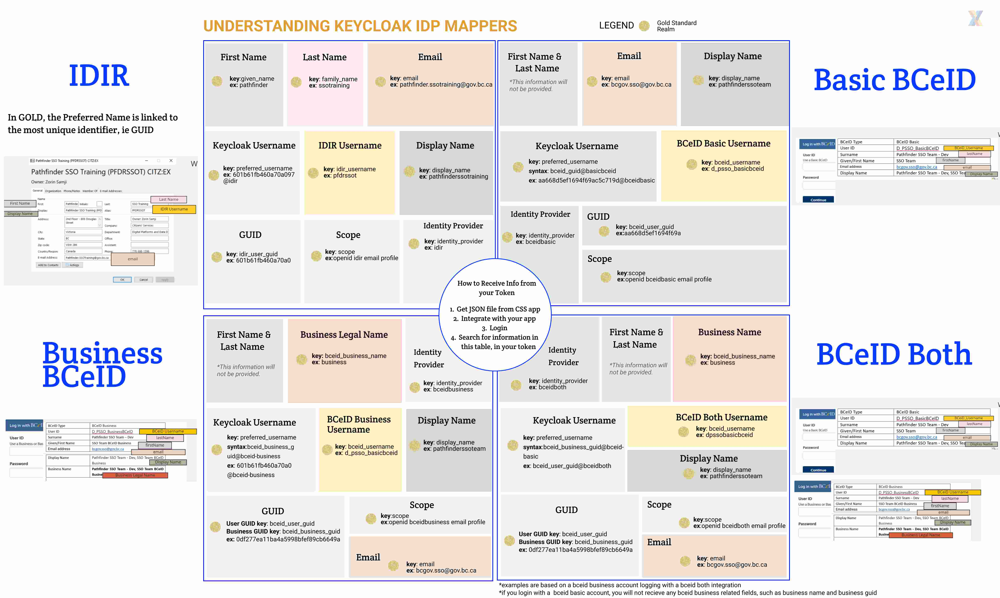
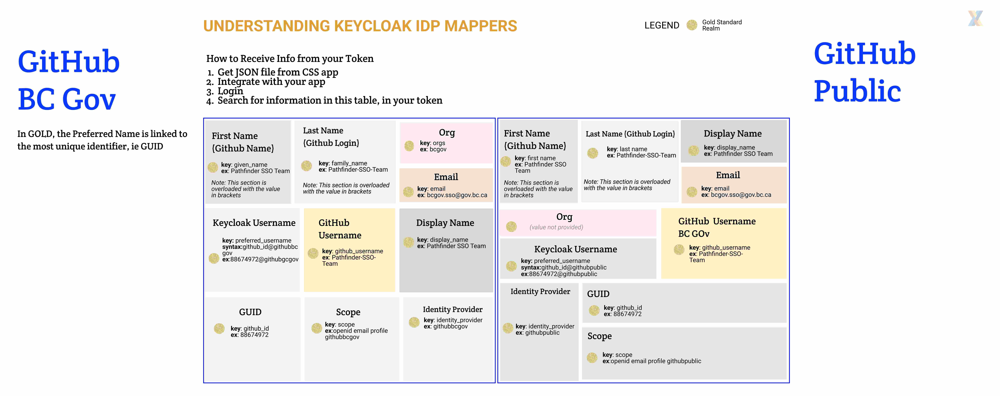

* Any other attribute can be fetched by the app itself using [IDIM Web Services](https://sminfo.gov.bc.ca/)

[Another way to view this from a developer perspective](https://bcgov.github.io/sso-docs/advanced/Custom%20Realms/identity-mappers)

## Playground
[Try our playground to see what comes in the payload with your client integration](https://bcgov.github.io/keycloak-example-apps/)
