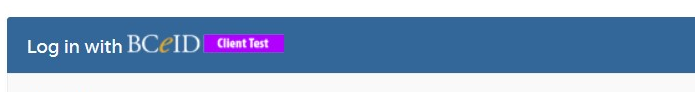
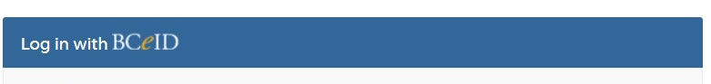
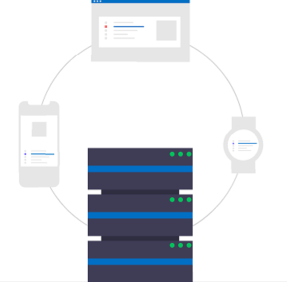

## Using your SSO Client

You can get started by making a request in our Common Hosted Single Sign On application.<embed link>. A few things to consider before making a request:

<ol>
  <li>The names of your product owner and technical contact.</li>
  <li>Someone on your team who knows about OpenID connect. You can learn here too <a href="https://www.youtube.com/playlist?list=PL9CV_8JBQHirMRjBk62jeYUE_MpE4unU8">OIDC Explained by Pathfinder SSO</a>.</li>
  <li>A rough idea on the identity provider (IDIR or BCeID) that you want to use. Learn more here <a href="Our-Partners-the-Identity-Providers#what-are-identity-providers">Our Partners</a>.
  <li>There are some parts of the request where you may need to work with your developer/technical contact:
    <ul>
      <li>Which usecase/scenario do you need a request for?</li>
      <li>Client type - do you want public or confidential?</li>
      <li>which environments and test accounts?</li>
      <li>Redirects.</li>
    </ul>
  </li>
  <li>Through the request process, you will get a few emails updating you on the process.</li>
  <li>When the request is complete, you can log in to access your installation json file. Your developer/technical contact will take the details in this file and make use of the details within your application code.
    <ul>
      <li> <a href="https://github.com/bcgov/keycloak-example-apps/tree/dev">GitHub - bcgov/keycloak-example-apps: Example applications for integrating with keycloak</a></li>
      <li>You can use roles to enable access to specific pages or data to only those users who connect, with efficiency, data security and simplicity under consideration. <a href="#Creating-a-Role">Learn more</a></li>
    </ul>
  </li>
  <li>Here is a link to our <a href="https://bcgov.github.io/sso-docs/">developer/technical documentation</a></li>
</ol>

### Openshift Clusters
In mid 2022, we moved our keycloak instance from the Platform Services **Silver Openshift cluster** to their **Gold Openshift cluster**. As of June 15, 2023, all of our services will live in Gold.

As part of the [Private Cloud Platform Openshift community](https://cloud.gov.bc.ca/private-cloud/) our service sits in the Gold Cluster which enables us to ensure our service is up 24/7. [Check out our up-to-date system health](https://uptime.com/s/bcgov-sso-gold)

#### Redhat SSO Version

Gold Current Version:  7.6.1.GA

decommissioned - Silver Current Version: 7.4.9.GA

For Red Hat SSO & Keycloak version information, please [see here](https://access.redhat.com/articles/2342881).

### Environments and Accounts

You will have a Pathfinder SSO client in each of the DEV, TEST and PROD servers. Assuming you have a DEV, TEST, and PROD environments for your application, this should give you the decoupling you need to set up each environment up with its own login context.

##### IDIR & GitHub Accounts

For IDIR and GitHub, your users will use "real" credentials in all three environments.

##### BCeID Accounts

**With our GOLD Service** - please ensure you have BCeID accounts mapped to the correct BCeID environment listed below. For questions on test accounts, please reach out to our IDIM partners at idim.consulting@gov.bc.ca or visit [BC Gov Stack Overflow](https://stackoverflow.developer.gov.bc.ca/questions/704)

| SSO CSS APP GOLD        | BCeID Env           | Visual Clue          |
| ------------- |:-------------:| :-----: |
| DEV     | BCeID DEV|  |
| TEST      | BCeID TEST       |    |
| PROD | BCeID PROD      |     |

** Note : If you want to point other instances of your application to your clients (such as ephemeral instances that are spun up for pull request validation or something), feel free to use DEV and TEST (but you will have to have valid redirect URIs configured for those instances).

  

---
