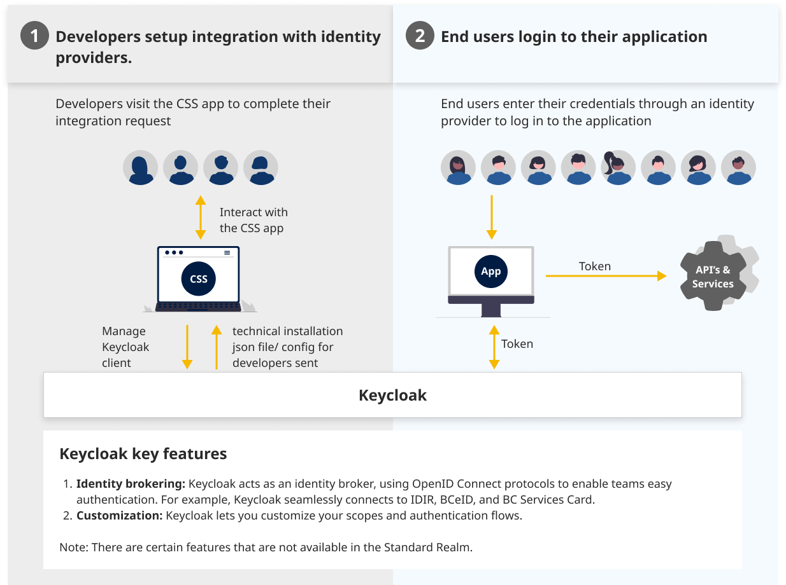

# What is keycloak?
Keycloak is an open source Identity and Access Management solution aimed at modern applications and services. It makes it easy to secure applications and services with little to no code. [Keycloak - About](https://www.keycloak.org/)

In BC Government, the Pathfinder SSO Keycloak server acts as an Open ID Connect [OIDC](https://openid.net/connect/) based Identity Provider, mediating with an enterprise user directory or 3rd-party SSO providers for identity information and applications via standards-based tokens and identity assertions.

## As a digital delivery team, what do i need to know about Keycloak?

Keycloak is organized by _realms_ which manages discrete sets of users that are logically isolated from one another and provides a linkage between the client application and a BC Government Identity Provider.

[Clients of our Standard Service via the CSS App](https://bcgov.github.io/sso-requests/) are configured to be part of a Standard Realm where certain realm parameters can be configured by clients and users can only authenticate to the realm in which they belong.

TLDR - Try our Standard Service and if it doesn't meet your needs, pop us a message on rocketchat.

# Learn More
The Pathfinder SSO service is build on the foundations of Keycloak /Redhat SSO.

* [Request an integration](https://bcgov.github.io/sso-requests/)
* [An overview of our CSS App](index)
* [Additional References](Useful-References)
